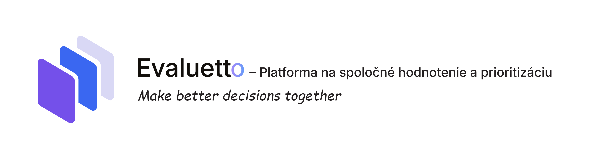

# Pavol Humený

Computer Science student at **Brno University of Technology – Faculty of Information Technology (FIT VUT)**.

I build modern web applications with a focus on **clean architecture, user experience, and maintainable software**.

## About Me

I'm a Computer Science student interested in **full-stack web development**, with a particular focus on React, TypeScript, backend development, and UI/UX.

I enjoy working on complete products — from the initial idea and interface design to implementation, testing, and deployment.

Currently, I'm focused on building modern applications and expanding my experience with scalable web architectures.

[LinkedIn](https://www.linkedin.com/in/pavol-humeny-580708288/) · [Email](mailto:pavol.humeny@gmail.com)

---

# Tech Stack

## Languages

---

## Frontend

---

## Backend

---

## Databases

---

## Cloud & DevOps

---

## Testing

---

## Design

---

## Tools

---

# Featured Projects

## Evaluetto

### Collaborative evaluation and decision-making platform

Evaluetto is a web application designed to support the entire process of **collaborative evaluation and decision-making**.

Instead of relying on multiple separate tools, Evaluetto brings the whole workflow into one place — from defining and sharing evaluation items to collecting individual evaluations, aggregating responses, and interpreting the final results.

Users can create custom evaluations, organize items into categories, invite participants, configure evaluation rules, and analyze the results.

**React · TypeScript · Material UI · NestJS · PostgreSQL · Prisma**

[View Repository](YOUR_EVALUETTO_REPOSITORY_URL)

---

## Figurio

### Web image editor for academic documents

Figurio is a browser-based image editor designed for preparing images for **academic and technical documents**.

It provides essential image editing tools directly in the browser, allowing users to quickly prepare figures without relying on dedicated desktop software.

[Open Figurio](https://app.fit.vut.cz/figurio)

---

## More Projects

More university, personal, and experimental projects are available in my repositories.
